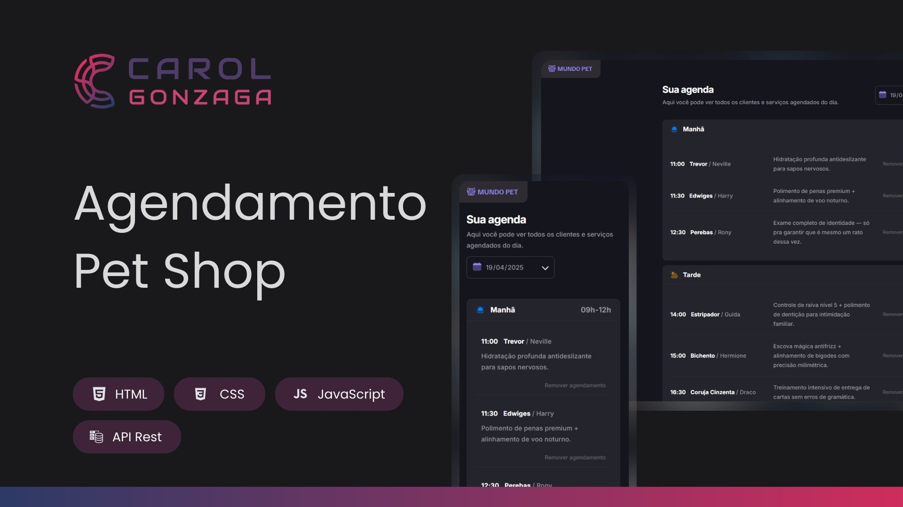

  

 

Uma aplicação de agendamento de serviços para pets, com interface leve, responsiva e integração com API simulada.

  <a href="#-tecnologias">Tecnologias</a>&nbsp;&nbsp;&nbsp;|&nbsp;&nbsp;&nbsp;
  <a href="#-objetivo">Objetivo</a>&nbsp;&nbsp;&nbsp;|&nbsp;&nbsp;&nbsp;
  <a href="#-funcionalidades">Funcionalidades</a>&nbsp;&nbsp;&nbsp;|&nbsp;&nbsp;&nbsp;
  <a href="https://petshop-agendamento.vercel.app" target="_blank">Acesse o Projeto</a>

 
 

  

 
 

## 🚀 Tecnologias

Esse projeto foi desenvolvido com as seguintes tecnologias:

-   HTML5
-   CSS3 (com abordagem mobile-first e responsividade)
-   JavaScript (ES6+)
-   Webpack
-   Babel
-   Day.js
-   JSON Server (simulando uma API REST)

 
 

## 🎯 Objetivo

O objetivo deste projeto é colocar em prática conceitos essenciais do desenvolvimento front-end moderno, como:

-   Manipulação do DOM com JavaScript
-   Consumo de API REST (GET, POST, DELETE)
-   Modularização do código (por funcionalidades e responsabilidades)
-   Integração com simulador de backend via `json-server`
-   Criação de interface acessível, responsiva e mobile-first
-   Organização do projeto com Webpack e Babel

 
 

## 🛠️ Funcionalidades

A aplicação permite que o usuário:

-   Visualize os agendamentos do dia, divididos por período (manhã, tarde e noite)
-   Cadastre novos agendamentos através de um modal com formulário validado
-   Selecione uma data e hora disponíveis com atualização em tempo real
-   Cancele agendamentos com um clique, atualizando a agenda automaticamente
-   Tenha uma experiência fluida e responsiva em diferentes tamanhos de tela
